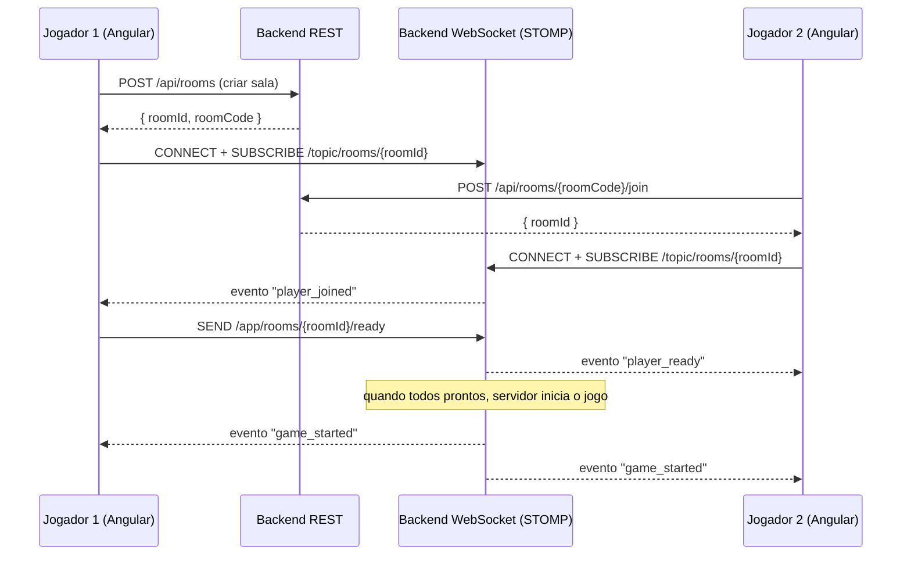

# Grash — Arquitetura do Projeto

Documento para avaliação de viabilidade. Nenhuma linha de código de aplicação foi escrita ainda — apenas o esqueleto de pastas e as decisões de arquitetura propostas abaixo.

---

## 1. Visão Geral

Grash é um jogo multiplayer online: jogadores se conectam, criam ou entram em **salas**, e jogam entre si em tempo real.

- **Backend**: Java 21 + Spring Boot 3
- **Frontend**: Angular (standalone components, sem NgModules)
- **Comunicação em tempo real**: WebSocket (STOMP sobre SockJS/WebSocket nativo)
- **Estratégia de repositório**: monorepo único chamado `Grash`, com `backend/` e `frontend/` como projetos independentes (cada um com seu próprio build)

---

## 2. Mono-repo vs. Multi-repo

| Critério | Mono-repo (recomendado agora) | Multi-repo |
|---|---|---|
| Times pequenos / solo dev | ✅ mais simples de gerenciar | ❌ overhead de sincronizar 2 repos |
| Deploys independentes | ✅ possível (pastas isoladas + CI por path) | ✅ nativo |
| Versionamento conjunto de contrato API | ✅ PRs atômicos (back+front juntos) | ❌ precisa coordenar 2 PRs |
| Escala para múltiplos times | ❌ fica pesado | ✅ melhor |

**Recomendação**: começar com **monorepo** (`Grash`). Se o projeto crescer e times/deploys se separarem, é trivial extrair `backend/` e `frontend/` para repositórios próprios depois (histórico preservável com `git subtree split`).

---

## 3. Estrutura de Pastas

```
Grash/
├── README.md
├── ARCHITECTURE.md
├── .gitignore
├── docs/
│   └── (diagramas, ADRs, decisões futuras)
│
├── backend/                          # grash-server (Java 21 / Spring Boot 3)
│   ├── pom.xml
│   ├── src/main/java/com/grash/server/
│   │   ├── GrashServerApplication.java
│   │   ├── config/                   # CORS, WebSocket, Security, Beans
│   │   ├── controller/                # REST (auth, salas, perfil)
│   │   ├── websocket/                 # handlers/controllers STOMP (eventos de jogo)
│   │   ├── service/                   # regras de negócio (RoomService, GameService)
│   │   ├── domain/                    # entidades (Player, Room, GameSession)
│   │   ├── dto/                       # objetos de transporte (Request/Response)
│   │   ├── repository/                # persistência (Spring Data JPA)
│   │   └── exception/                 # exceções + handler global
│   ├── src/main/resources/
│   │   └── application.yml
│   └── src/test/java/...
│
└── frontend/                         # grash-web (Angular)
    ├── angular.json
    ├── package.json
    ├── src/app/
    │   ├── core/                      # singletons: services, guards, interceptors, models
    │   ├── shared/                    # componentes/pipes/diretivas reutilizáveis
    │   ├── layout/                    # header, footer, shell
    │   └── features/
    │       ├── lobby/                 # listar/criar/entrar em salas
    │       ├── room/                  # sala de espera (chat, jogadores prontos)
    │       └── game/                  # tela de jogo em si
    └── src/assets/
```

> Pastas vazias hoje têm um `.gitkeep` só para o Git rastreá-las — serão preenchidas na fase de implementação.

---

## 4. Stack Tecnológica

### Backend (Java 21)
- **Spring Boot 3.3+** — LTS, suporte nativo a Java 21 (virtual threads, records, pattern matching)
- **Spring Web** — REST (autenticação, CRUD de salas, perfil)
- **Spring WebSocket + STOMP** — comunicação em tempo real (eventos de jogo, chat de sala)
- **Spring Data JPA + PostgreSQL** — dados persistentes (usuários, histórico de partidas, ranking)
- **Redis** (a partir da fase de escala) — estado de salas ativas compartilhado entre instâncias + pub/sub para múltiplos nós do backend
- **Spring Security + JWT** — autenticação stateless
- **Maven** — build (mais previsível para times pequenos; Gradle é alternativa válida)
- **Testcontainers + JUnit 5** — testes de integração

### Frontend (Angular)
- **Angular 18+** — standalone components, Signals para estado local
- **RxJS** — streams de eventos WebSocket
- **@stomp/stompjs + sockjs-client** — cliente STOMP
- **NgRx (opcional, fase 2)** — estado global se a complexidade justificar (lobby + sala + jogo simultâneos)
- **Angular Material ou Tailwind** — UI (a definir conforme identidade visual do jogo)

### Infraestrutura (fase posterior)
- Docker + docker-compose (backend + Postgres + Redis) para dev local
- CI/CD (GitHub Actions): lint/test/build para `backend/` e `frontend/` com paths-filter (só builda o que mudou)

---

## 5. Fluxo de Comunicação



- **REST**: operações pontuais (criar sala, entrar por código, listar salas públicas, autenticação, perfil).
- **WebSocket/STOMP**: tudo que é tempo real (estado da sala, jogadas, chat, sincronização de jogo).

---

## 6. Modelo de Domínio Inicial

```
Player
 ├─ id, nickname, (userId se autenticado)
 └─ status: ONLINE | IN_ROOM | IN_GAME

Room
 ├─ id, code (para convite), name, isPrivate
 ├─ players: List<Player> (com limite configurável)
 ├─ status: WAITING | IN_PROGRESS | FINISHED
 └─ ownerId

GameSession
 ├─ roomId
 ├─ estado do jogo (regras específicas do jogo escolhido)
 └─ histórico de jogadas
```

> O "jogo" em si (regras, tabuleiro, pontuação) ainda não foi definido — a arquitetura acima é agnóstica ao jogo específico, então esse é o próximo ponto a esclarecer.

---

## 7. Segurança (fase inicial)

- Autenticação simples por nickname/sessão para MVP, evoluindo para JWT + refresh token.
- Validação de entrada em todos os endpoints REST e nos handlers STOMP (nunca confiar no client para regras de jogo).
- Rate limiting básico em criação de salas para evitar spam.
- CORS restrito ao domínio do frontend.

---

## 8. Escalabilidade (quando necessário, não no MVP)

- Estado de sala hoje pode viver em memória (`ConcurrentHashMap`) — simples e suficiente para 1 instância.
- Ao escalar horizontalmente, migrar estado de sala para **Redis** + usar **Redis Pub/Sub** ou **Spring Cloud Bus** para que instâncias do backend sincronizem eventos de sala entre si (um jogador pode estar conectado a uma instância diferente da do outro jogador da mesma sala).
- Virtual Threads (Java 21) ajudam a lidar com muitas conexões WebSocket simultâneas sem esgotar thread pool.

---

## 9. Boas Práticas Aplicadas

- Separação em camadas (`controller` → `service` → `repository`), sem lógica de negócio no controller.
- DTOs para nunca expor entidades JPA diretamente na API.
- Testes: unitários (service) + integração (Testcontainers com Postgres real).
- Convenções: `feature/`, `fix/`, `chore/` para branches; Conventional Commits para mensagens de commit.
- `.gitignore` já cobre `target/`, `node_modules/`, `.idea/`, `.env`, builds e o arquivo local que você pediu para ignorar.

---

## 10. Roadmap Sugerido

1. **Fase 0 (atual)**: esqueleto + arquitetura (este documento) ✅
2. **Fase 1 — MVP**: criar/entrar em sala, lobby, WebSocket básico, 1 jogo simples funcionando fim a fim
3. **Fase 2**: autenticação real (JWT), persistência de partidas, reconexão em caso de queda
4. **Fase 3**: escalabilidade (Redis), matchmaking, ranking/histórico
5. **Fase 4**: deploy (Docker + CI/CD), monitoramento

---

## 11. Perguntas em Aberto (preciso da sua decisão antes de codar)

1. Qual é o jogo em si? (regras específicas mudam bastante o `domain/` e o `game/` do front)
2. Quantos jogadores por sala? Salas públicas e privadas, ou só privadas com código?
3. Precisa de contas persistentes (login) desde o MVP, ou nickname temporário já resolve?
4. Tem preferência de banco (Postgres é a sugestão) ou já usa algo?
5. Onde pretende hospedar (isso influencia decisões de Docker/CI)?
