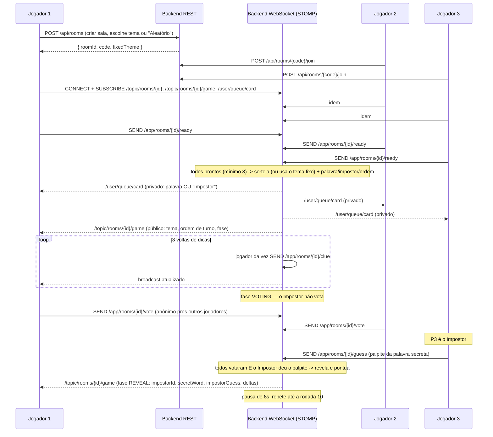

# Grash — Arquitetura do Projeto

> **Status:** MVP jogável de ponta a ponta — o jogo do Impostor completo (10
> rodadas, tema fixo ou aleatório, dicas em turno, votação anônima sem o
> Impostor, palpite do Impostor sobre a palavra, revelação e pontuação),
> testado com múltiplos jogadores reais via navegador. Sem banco de dados,
> sem contas — tudo em memória, nickname temporário por sessão.

---

## 1. Visão Geral

Grash é o jogo do Impostor (mesma família de "Palavra Impostora"/"Word
Wolf"/"Spyfall"): jogadores entram numa sala, e a cada rodada todos exceto
um (o Impostor) recebem a mesma palavra secreta de um tema (ex.: um campeão
de League of Legends, uma profissão, um animal). O Impostor não sabe a
palavra — só o tema. Todos dão dicas em turno sobre a palavra sem dizê-la
diretamente; ao final, todos exceto o Impostor votam em quem acham que é
o Impostor, e o Impostor tenta adivinhar a palavra secreta.

Quem cria a sala escolhe o tema (fixo pras 10 rodadas) ou deixa "Aleatório"
(sorteia um tema novo a cada rodada).

- **Backend**: Java 21 + Spring Boot 3 — tudo em memória, sem banco de dados
- **Frontend**: Angular (standalone components, sem NgModules)
- **Comunicação em tempo real**: WebSocket (STOMP sobre SockJS)
- **Repositório**: monorepo único (`Grash`), com `backend/` e `frontend/` como projetos independentes

---

## 2. Estrutura de Pastas

```
Grash/
├── README.md
├── ARCHITECTURE.md
├── render.yaml                        # Blueprint de deploy (Render)
├── backend/                           # grash-server (Java 21 / Spring Boot 3)
│   ├── pom.xml
│   ├── Dockerfile
│   ├── src/main/java/com/grash/server/
│   │   ├── GrashServerApplication.java
│   │   ├── config/                    # CORS, WebSocket
│   │   ├── controller/                # REST (salas, temas)
│   │   ├── websocket/                 # STOMP: join/ready/clue/vote/guess
│   │   ├── service/                   # RoomService, GameService, WordBankService
│   │   ├── domain/                    # Room, Player, RoundState, RoundPhase, ClueEntry
│   │   ├── dto/                       # objetos de transporte
│   │   └── exception/                 # exceções + handler global
│   └── src/main/resources/
│       ├── application.yml
│       └── word-bank.json             # banco de palavras (temas + palavras)
│
└── frontend/                          # grash-web (Angular)
    ├── angular.json
    ├── package.json
    └── src/app/
        ├── core/                      # services, models
        └── features/
            ├── lobby/                 # criar/entrar em sala
            ├── room/                  # sala de espera ("pronto")
            └── game/                  # carta, dicas, votação, revelação, placar
```

---

## 3. Stack Tecnológica

### Backend (Java 21)
- **Spring Boot 3.3** — Web (REST), WebSocket + STOMP (tempo real)
- **Sem banco de dados** — tudo em `ConcurrentHashMap` em memória (ver seção 8)
- **Jackson** — carrega `word-bank.json` uma vez na subida do servidor
- **Maven**

### Frontend (Angular)
- **Angular 18+** — standalone components, Signals, novo control flow (`@if`/`@for`/`@switch`/`@let`)
- **@stomp/stompjs + sockjs-client** — cliente STOMP

### Infraestrutura
- **Docker** (`backend/Dockerfile`) + **Render** (`render.yaml`) — ver `README.md`
- Sem Postgres, sem Redis, sem serviço de e-mail — nada disso é necessário (sem contas de usuário)

---

## 4. Fluxo de Comunicação



- **REST**: só criar sala / entrar por código / consultar sala.
- **WebSocket/STOMP**: todo o resto (pronto, dicas, votos, estado da rodada).

---

## 5. Modelo de Domínio

```
Player
 ├─ id, nickname, status (WAITING | READY)
 └─ score (acumulado nas 10 rodadas)

Room
 ├─ id, code (convite), ownerId
 ├─ fixedTheme: tema escolhido na criação (null = sorteia um tema novo por rodada)
 ├─ players: Map<id, Player>
 ├─ status: WAITING | IN_PROGRESS | FINISHED
 └─ currentRound: RoundState (null até o jogo começar)

RoundState (uma das 10 rodadas)
 ├─ roundNumber, theme, secretWord, impostorId   ← nunca vai no broadcast público
 ├─ turnOrder: List<playerId>                    (sorteado a cada rodada)
 ├─ phase: CLUE_GIVING | VOTING | REVEAL
 ├─ clues: List<ClueEntry> (playerId, lap, texto)
 ├─ votes: Map<voterId, votedForId>              (impostor não vota, não aparece aqui)
 └─ impostorGuess, impostorGuessedCorrectly       (palpite do Impostor sobre a palavra)
```

---

## 6. Banco de palavras

`word-bank.json` (em `backend/src/main/resources/`) — um mapa `{ "Tema": ["palavra1", "palavra2", ...] }`,
carregado uma única vez na subida do servidor pra um `Map` em memória
(`WordBankService`). Sorteio de tema+palavra é O(1); zero I/O em disco ou
banco durante o jogo.

**Por que esse formato**: sem banco de dados no projeto, um arquivo
versionado no próprio repositório é a forma mais simples de manter um
conteúdo que muda pouco e precisa carregar rápido. Editar/adicionar temas é
só editar o JSON — não exige migração nem deploy de schema.

Temas atuais (8, cada um com bem mais de 50 palavras):

| Tema | Palavras |
|---|---|
| League of Legends | 148 (campeões) |
| Profissões | 78 |
| Animais | 73 |
| Frutas | 59 |
| Países | 62 |
| Esportes | 55 |
| Instrumentos Musicais | 58 |
| Objetos do Dia a Dia | 62 |

---

## 7. Regras do jogo (decisões de implementação)

O pedido original deixava algumas regras implícitas — as decisões abaixo
preenchem essas lacunas:

1. **Mínimo de 3 jogadores** para iniciar — com 2, a votação seria trivial
   (o não-impostor saberia de cara quem é o outro).
2. **Sorteio do impostor com rotação justa**: em vez de sortear 100%
   independente a cada uma das 10 rodadas (o que poderia deixar alguém
   nunca ser impostor, ou ser impostor toda hora só por azar), o servidor
   embaralha a lista de jogadores e consome em ordem; ao "dar a volta" (ou
   se o grupo de jogadores mudar), embaralha de novo. Isso distribui o
   papel o mais igualmente possível ao longo do jogo. Ver
   `GameService.pickImpostor`.
3. **Tema fixo ou aleatório**: quem cria a sala escolhe um tema específico
   (fica valendo pras 10 rodadas do jogo) ou "Aleatório" (sorteia um tema
   novo a cada rodada, como antes). Ver `Room.fixedTheme` e
   `RoomService.createRoom`.
4. **O impostor não vota** — na fase `VOTING`, os demais jogadores votam
   anonimamente em quem acham que é o Impostor, e, em paralelo, o próprio
   Impostor tenta adivinhar a palavra secreta da rodada (campo separado,
   `impostorGuess`). A rodada só avança pra `REVEAL` quando **todos os
   não-impostores votaram E o Impostor enviou um palpite**. Ver
   `GameService.submitVote` / `submitImpostorGuess` / `checkVotingComplete`.
5. **Comparação do palpite**: tanto a palavra secreta quanto o palpite do
   Impostor são normalizados antes de comparar — remove todo caractere que
   não seja letra/dígito (inclusive espaços) e converte pra maiúsculas
   (`s.replaceAll("[^\\p{L}\\p{N}]", "").toUpperCase()`). Se o resultado for
   igual, o palpite conta como certo. Ver `GameService.wordsMatch`.
6. **Pontuação**:
   - Cada jogador não-impostor que vota corretamente no Impostor ganha
     **1 ponto** (`CORRECT_VOTE_POINTS`) — **a menos que** o Impostor tenha
     acertado a palavra (ver abaixo), caso em que ninguém ganha ponto por
     voto, nem quem votou certo.
   - Cada jogador não-impostor que vota errado dá **2 pontos** ao Impostor
     (`WRONG_VOTE_IMPOSTOR_POINTS`) — então o Impostor pode ganhar vários
     pontos por votos errados numa rodada só, independente do palpite.
   - Se o Impostor acerta a palavra secreta, ganha um bônus de **3 pontos**
     (`IMPOSTOR_CORRECT_GUESS_BONUS`) **e** anula os pontos que os votantes
     corretos ganhariam naquela rodada (o Impostor "sai vencedor" da
     rodada). Os pontos de voto errado (item acima) continuam valendo
     normalmente pro Impostor mesmo quando ele acerta.
   - Mensagem mostrada a todos na revelação: se o Impostor acertou, "*(nome)
     acertou a palavra!*"; se errou, "*(nome) chutou: (palpite)*". Ver
     `GameStateMessage` (`impostorGuessedCorrectly`, `impostorGuess`,
     `secretWord`) e `GameService.revealAndScore`.
7. **Empate por posição**: se dois jogadores terminam com a mesma pontuação
   máxima, os dois são mostrados como vencedores na tela final.
8. **Avanço automático de rodada**: depois da revelação, uma pausa de 8s
   (`GameConstants.REVEAL_DURATION_SECONDS`) e a próxima rodada começa
   sozinha — sem precisar de clique/confirmação de ninguém.

---

## 8. Segurança da informação: como a carta privada funciona

O requisito mais delicado tecnicamente: cada jogador precisa ver uma carta
diferente (a palavra, ou "Impostor") sem que ninguém mais veja a dele — e
o projeto não tem login, então não dá pra usar autenticação pra endereçar
mensagens privadas do jeito "tradicional" do Spring.

Solução: STOMP suporta enviar mensagem pra uma **sessão específica**, sem
precisar de um usuário autenticado — usando o `sessionId` da conexão
WebSocket no lugar de um "usuário":

```java
SimpMessageHeaderAccessor headerAccessor = SimpMessageHeaderAccessor.create(SimpMessageType.MESSAGE);
headerAccessor.setSessionId(sessionId);
headerAccessor.setLeaveMutable(true);
messagingTemplate.convertAndSendToUser(sessionId, "/queue/card", payload, headerAccessor.getMessageHeaders());
```

O cliente assina `/user/queue/card` normalmente — o `UserDestinationMessageHandler`
do Spring entrega só pra aquela sessão específica, mesmo sem login. Ver
`GameService.sendPrivate` e `WebSocketSessionRegistry` (mapeia
`playerId -> sessionId` pra saber pra quem endereçar).

O broadcast público (`/topic/rooms/{id}/game`) nunca contém `secretWord`
nem `impostorId` antes da fase `REVEAL` — validado em teste (ver histórico
de testes desta sessão).

---

## 9. Escalabilidade (quando necessário, não no MVP)

Tudo — salas, jogadores, rodadas — vive em memória numa única instância do
backend (`ConcurrentHashMap`). Reiniciar o servidor apaga as salas ativas;
rodar múltiplas instâncias exigiria mover esse estado pra um backplane
compartilhado (Redis) e sincronizar o broker STOMP entre instâncias — não
vale a pena para o estágio atual do projeto.

---

## 10. Limitações conhecidas do MVP atual

- Sem reconexão: se a conexão websocket cair no meio de uma rodada, o
  jogador não volta automaticamente (precisa recarregar e reentrar) — e o
  jogo pode ficar esperando a dica/voto dele indefinidamente.
- Sem moderação de conteúdo das dicas (texto livre) — dá pra digitar
  qualquer coisa, inclusive a própria palavra secreta sem o servidor
  impedir.
- Sem testes automatizados no repositório (foram feitos testes manuais
  extensivos via script durante o desenvolvimento, não commitados).
- Rate limiting não existe (não tem mais superfície de abuso tipo
  login/registro depois da remoção de contas).
- Estado 100% em memória — reiniciar o backend apaga todas as salas.

---

## 11. Roadmap sugerido

1. **Fase 0**: esqueleto + arquitetura ✅
2. **Fase 1**: salas em tempo real (código, lobby, pronto) ✅
3. **Fase 2**: jogo do Impostor completo (10 rodadas, dicas, votação, pontuação) ✅
4. **Fase 3 (ideias futuras)**: reconexão, moderação básica de dicas, mais
   temas no banco de palavras, histórico de partidas (exigiria voltar a
   pensar em persistência), suporte a mais de 8 jogadores por sala.
